# quickmenu.koplugin

`quickmenu.koplugin` is a highly customizable menu plugin designed to enhance navigation and accessibility on your e-reader. By providing a centralized hub for frequently used actions, light settings, and shortcuts, it streamlines the reading experience, allowing for quick adjustments without navigating deep into system menus.

  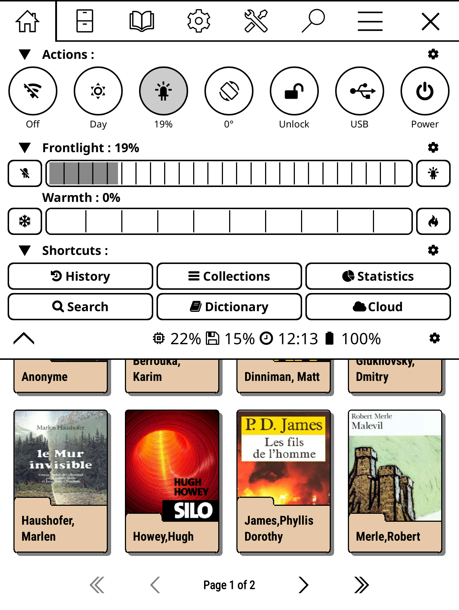
  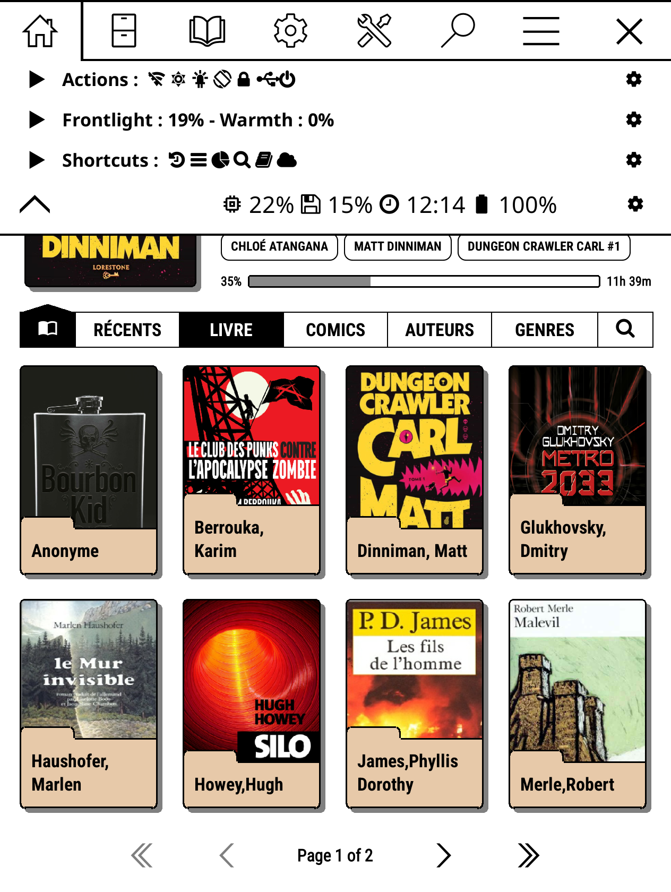
  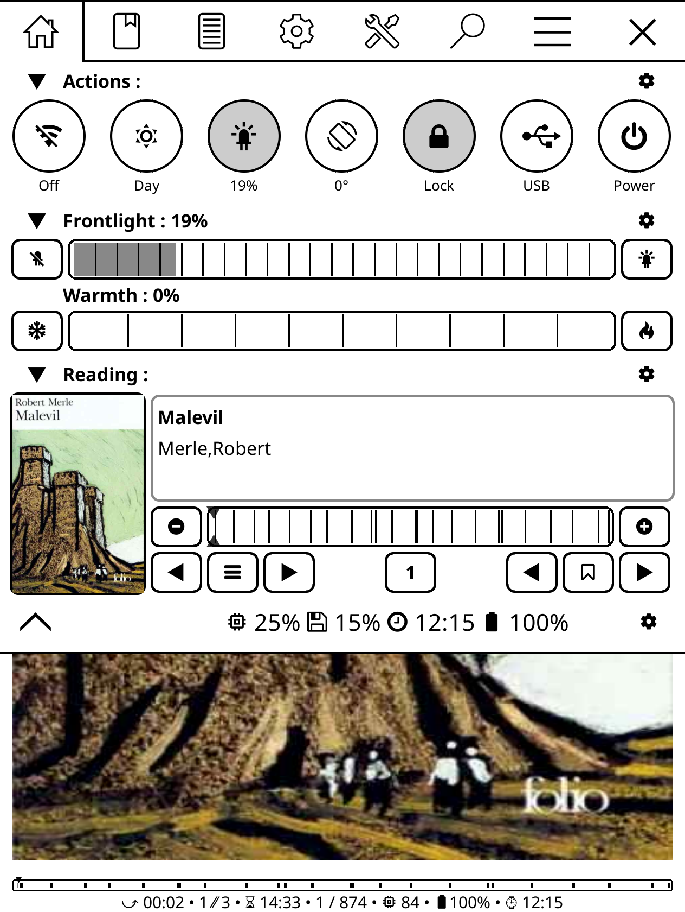

## Core Sections

* **Exit:** A dedicated exit tab provides a unified way to manage your session. 
  - **In Filemanager:** Tap to close the menu, or hold to quit KOReader.
  - **In Reader:** Tap to close the menu, or hold to quit the reader and return to the Filemanager.
 

  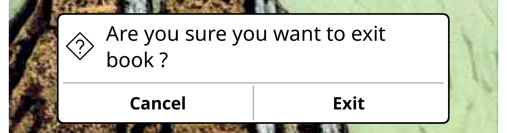

 
* **Actions:** This section provides quick-access toggles for essential device functions, such as Wi-Fi, orientation lock, power, and USB connection. It allows you to toggle system states instantly with a single tap.

  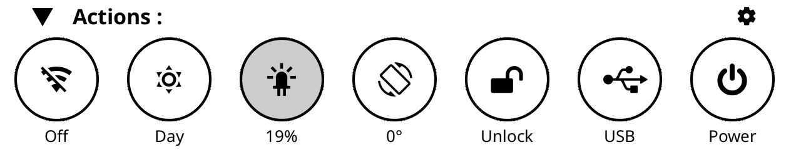

* **Frontlight:** Easily manage your visual comfort with dedicated controls for both intensity and warmth. This section offers granular adjustments to ensure your screen brightness and color temperature are perfectly suited to your environment.

  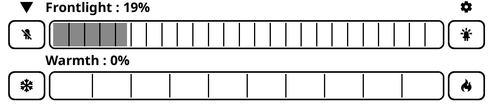

* **Shortcuts:** A customizable grid of buttons providing direct access to key features like your Library, Collections, Search, Dictionary, and Cloud services, helping you jump to your preferred areas with ease.

  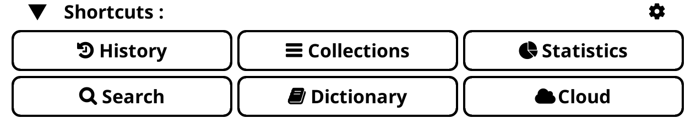

* **Reading:** Designed for in-reading utility, this section provides quick tools to manage your current book or document session, ensuring common reading-related tasks are always one tap away.

  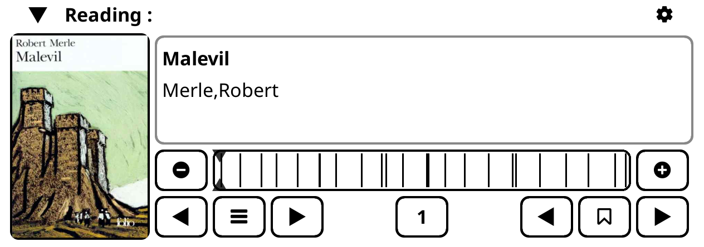

| Skim | Tap | Hold |
|:-------- |:--------:|:--------:|
| Page - | Decrease page by 1 | Set page to first |
| Page + | Increase page by 1 | Set page to last |
| Chapter - | Decrease chapter by 1 | Set chapter to first |
| Chapter toogle | Show "table of contents" | Show "book map" |
| Chapter + | Increase chapter by 1 | Set chapter to last |
| Page indicator | Show "goto page dialog" | Go to original page |
| Bookmark - | Decrease bookmark by 1 | Set bookmark to first |
| Bookmark toogle | Toogle bookmark | Show "bookmark" |
| Bookmark + | Increase bookmark by 1 | Set bookmark to last |

* **Footer:** The status bar at the bottom acts as a summary panel, displaying real-time system information including CPU usage, storage availability, current time, and battery level, keeping you informed at a glance.

  

## Settings
The settings interface allows users to tailor the Quick Menu to their specific workflow. You can toggle visibility for individual tabs (such as the exit tab or the main quick menu tab) and configure startup behavior to ensure the menu opens exactly how you prefer every time you access it.

The settings interface allows users to tailor the Quick Menu to their specific workflow. Every section can be easily configured by clicking the **gear icon (Settings)** directly within the Quick Menu. Any adjustments made are applied instantly, ensuring the interface updates in real-time to match your preferences. You can also toggle visibility for individual section and configure startup behavior to ensure the menu opens exactly how you prefer every time you access it.

  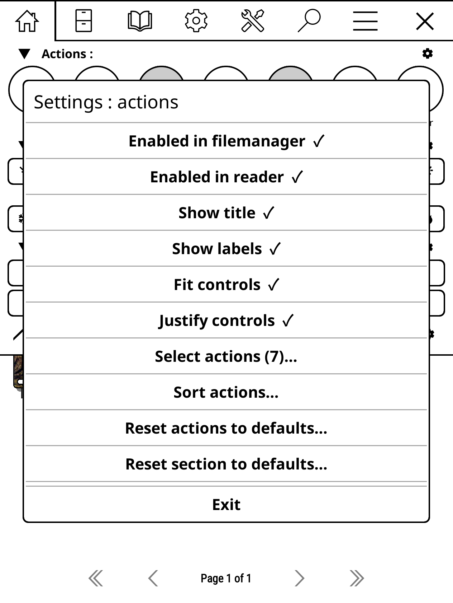
  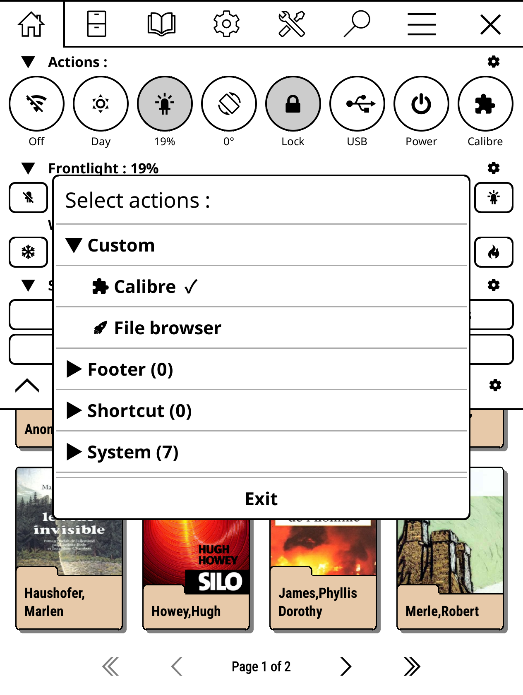
  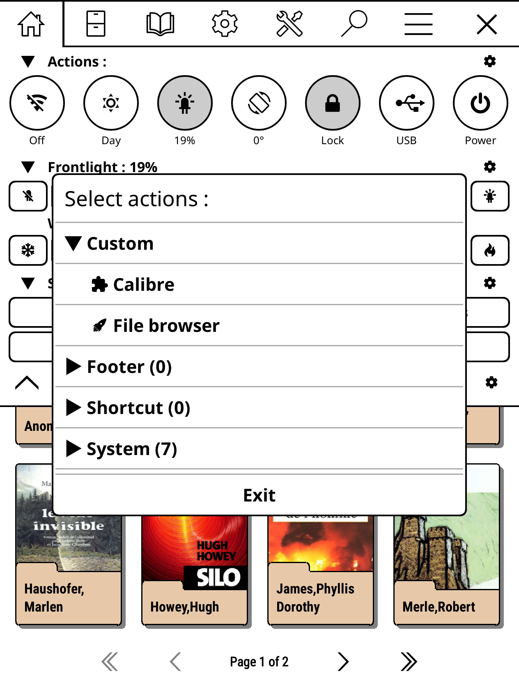
  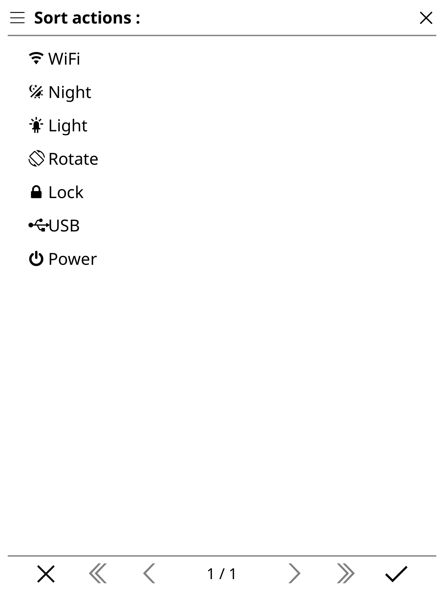

## Custom Actions
The plugin features a robust custom actions engine. Users can define their own menu items, assign custom icons from an extensive internal library, and map specific triggers to actions like "Tap" or "Hold." This flexibility allows you to integrate plugins, system commands, or specific menu navigation directly into your personalized dashboard.

  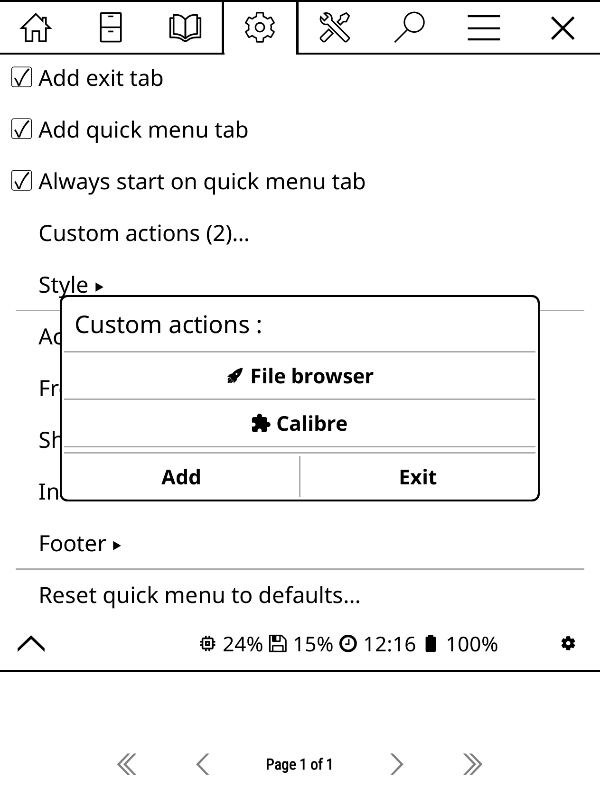
  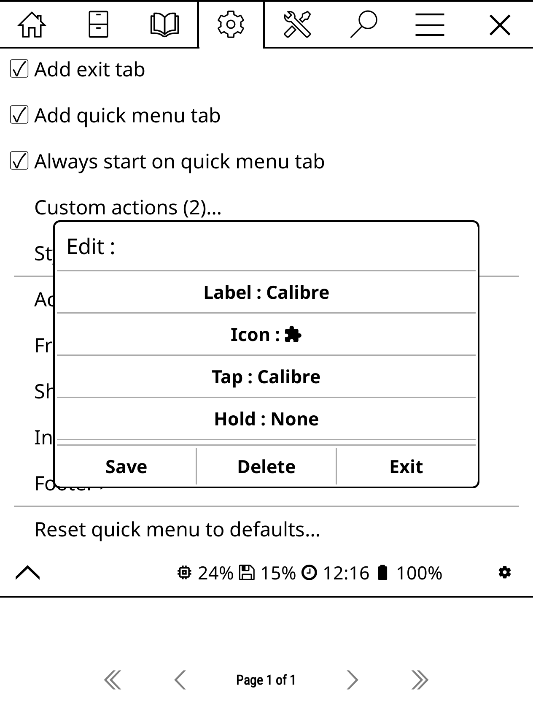
  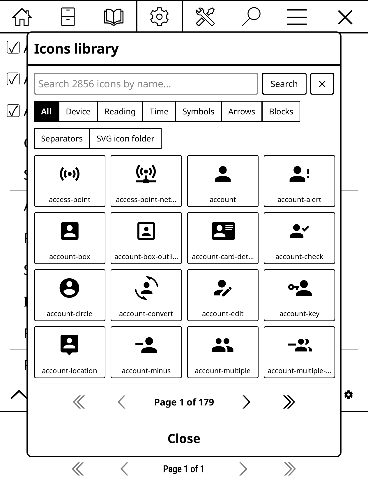
  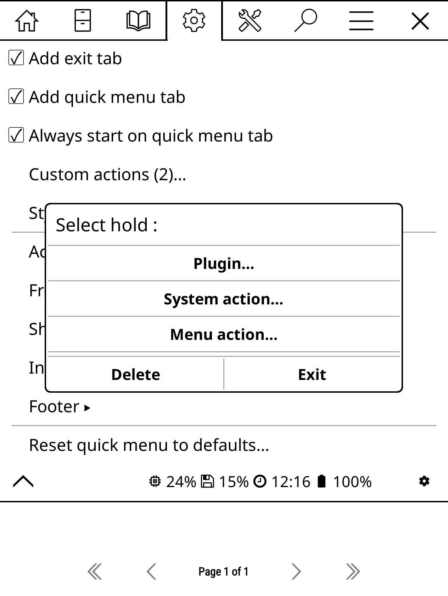

## Credits

This plugin has been built by building upon the work and ideas of several community contributors. A special thanks to:

* **[qewer33](https://github.com/qewer33)** for the original idea behind the [quick-settings patch](https://github.com/qewer33/koreader-patches).
* **[AndyHazz](https://github.com/AndyHazz)** for the icon and action selectors implemented in [bookshelf.koplugin](https://github.com/AndyHazz/bookshelf.koplugin).
* **[doctorhetfield-cmd](https://github.com/doctorhetfield-cmd)** for the power menu implementation from [simpleui.koplugin](https://github.com/doctorhetfield-cmd/simpleui.koplugin).
* **[AnthonyGress](https://github.com/AnthonyGress)** for the sliders and `touch_menu` hooks inspired by [zen_ui.koplugin](https://github.com/AnthonyGress/zen_ui.koplugin).

## Installation

1. Download the `quickmenu.koplugin.zip` from the [Releases](https://github.com/jbreizh/quickmenu.koplugin/releases) page.
2. Unzip the archive and copy the `quickmenu.koplugin` **folder** into your device's plugins directory.
3. Restart KOReader.

| Device | Plugins directory |
|--------|-------------------|
| **Kobo** | `/mnt/onboard/.adds/koreader/plugins/` |
| **Kindle** | `/mnt/base-us/koreader/plugins/` |
| **PocketBook** | `/mnt/ext1/applications/koreader/plugins/` |
| **Android** | `sdcard/koreader/plugins/` |
| **Desktop (Linux/macOS)** | `/koreader/plugins/` |

## Actions list

The following tables detail the available actions, their labels, and the functionality triggered by **Tap** or **Hold** gestures.

### System Actions
| Action | Label | Tap | Hold |
| :--- | :--- | :--- | :--- |
| **WiFi** | WiFi | Toggle Wi-Fi | Show Wi-Fi picker |
| **Night** | Day/Night | Toggle night mode | N/A |
| **Light** | Intensity % | Toggle frontlight | Show frontlight dialog |
| **Warmth** | Warmth % | N/A | Show frontlight dialog |
| **Rotate** | 0/90/180/270° | Swap rotation | Invert rotation |
| **Lock** | Lock/Unlock | Toggle lock gsensor | Toggle ignore gsensor |
| **USB** | USB | Request USB mass storage | N/A |
| **Restart** | Restart | Ask to restart KOReader | Ask to exit KOReader |
| **Exit** | Exit | Ask to exit KOReader | Ask to restart KOReader |
| **Reboot** | Reboot | Ask for system reboot | Ask for power off |
| **Sleep** | Sleep | Suspend system | N/A |
| **Power off** | Power off | Ask for power off | Ask for reboot |
| **Power** | Power | Show power dialog | N/A |
| **KOSync** | KOSync | Push progress | Pull progress |
| **SSH** | On/Off | Toggle SSH server | N/A |
| **Calibre** | On/Off | Toggle wireless connection | N/A |

### Shortcut Actions
| Action | Label | Tap | Hold |
| :--- | :--- | :--- | :--- |
| **Dictionary** | Dictionary | Show dictionary search | Show wikipedia search |
| **Wikipedia** | Wikipedia | Show wikipedia search | Show dictionary search |
| **History** | History | Show history | Open last book |
| **Resume** | Last File | Open last book | Show history |
| **Collections** | Collections | Show collections | Show favorites |
| **Favorites** | Favorites | Show favorites | Show collections |
| **Cloud** | Cloud | Show cloud storage | Show OPDS catalog |
| **OPDS** | OPDS | Show OPDS catalog | Show cloud storage |
| **Search** | Search | Show file search | Show Calibre search |
| **Calibre (Search)**| Calibre | Show Calibre search | Show file search |
| **Statistics** | Statistics | Show reader statistics | Show calendar statistics |
| **Calendar** | Calendar | Show calendar statistics | Show reader statistics |

### Footer Actions
| Action | Label | Tap | Hold |
| :--- | :--- | :--- | :--- |
| **Process** | Memory (MB) | Show process memory | Show system statistics |
| **CPU** | CPU (%) | Show CPU usage | Show system statistics |
| **Memory** | Mem (used/avail/total) | Show memory usage | Show system statistics |
| **Storage** | Storage (used/avail/total)| Show storage usage | Show system statistics |
| **Time** | Time | Show full date/time | N/A |
| **Battery** | Battery % | Show battery status | Show battery statistics |
| **Aux Battery** | Aux Battery % | Show aux battery status | Show battery statistics |

> **Note:** Actions requiring specific plugins (e.g., `systemstat`, `batterystat`, `opds`, `calibre`, `SSH`) will display an informational message if the corresponding plugin is not active[cite: 2].

