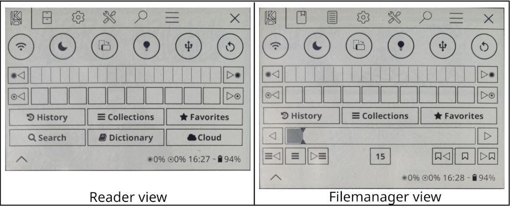
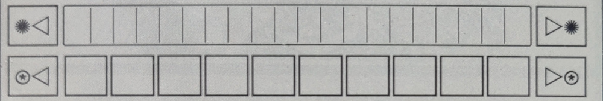

# quickmenu.koplugin

Advanced version of [quick-settings patch from qewer33](https://github.com/qewer33/koreader-patches). Mix of personnal and others forks ideas:
- Adds a Quick menu tab as the first tab in the KOReader top menu that provides a fast access to common actions and device controls without navigating through menus.
- Adds an Exit tab as the last tab in the Koreader top menu that provides an unify way to close the menu, close the reader and close Koreader.

The idea is to remain simple and not change everything like zenui or simpleui. It just focus on the top menu.

## Installation

1. Go to the [Releases](https://github.com/jbreizh/quickmenu.koplugin/releases) page and download `quickmenu.koplugin.zip` from the latest release.
2. Unzip the archive. You should have a **folder** named `quickmenu.koplugin`.
3. Copy the `quickmenu.koplugin` **folder** into the KOReader plugins directory for your device: See table below
      - Make sure you are copying the unzipped **folder** and **not the .zip** file itself
4. Restart KOReader. Quickmenu will load automatically

| Device | Plugins directory |
|--------|-------------------|
| **Kobo** | `/mnt/onboard/.adds/koreader/plugins/` |
| **Kindle** | `/mnt/base-us/koreader/plugins/` |
| **PocketBook** | `/mnt/ext1/applications/koreader/plugins/` |
| **Android** | `sdcard/koreader/plugins/` |
| **Desktop (Linux/macOS)** | `/koreader/plugins/` |

## Patches
  
The Quick Settings patch can be configured from **Settings" (Gear icon) -> "Quick menu** :

### exit-button

**In filemanager :**  Add an exit button at the left size of the top menu.

**In reader :** Remove filemanager button and add an exit button at the left size of the top menu.

| Context | Tap | Hold |
|:-------- |:--------:|:--------:|
| Filemanager | Close menu | Quit Koreader |
| Reader | Close menu | Quit Reader (launch Filemanager) |

### Actions (Both in Filemanager and reader views)

| Action | Label | Indicator | Tap | Hold | Default |  |
|:--------|:-------:|:-------:|:-------:|:-------:|:-------:|:-------:|
| Wifi | SSID | When connected | Toggle and connect wifi | Toggle and launch wifi picker | [x] | Core |
| Night |  | When enabled | Toggle night mode |  | [x] | Core |
| Light |  | When enabled | Toggle frontlight |  | [x] | Core |
| Rotate |  | | Rotate screen 90° | Invert screen 180° | [x] | Core |
| Lock |  | When partial/complet lock | Toggle partial lock | Toggle complet lock | [x] | Core |
| USB |  |  | Toggle mass storage |  | [x] | Core |
| Restart |  |  | Restart Koreader (with confirmation) |  | [x] | Core |
| Exit |  |  | Exit Koreader (with confirmation) |  | [ ] | Core |
| Sleep |  |  | Suspend device |  | [ ] | Core |
| SSH |  | When enabled | Toggle SSH server |  | [ ] | Core plugin |
| Calibre |  | When enabled | Toggle Calibre wireless connection |  | [ ] | Core plugin |

### Frontlight (Both in Filemanager and reader views)

| Frontlight | Tap | Hold |
|:-------- |:--------:|:--------:|
| Intensity - | Decrease intensity by 1% | Set intensity to 0% (off) |
| Intensity + | Increase intensity by 1% | Set intensity to 100% (max) |
| Warmth - | Decrease warmth by 10% | Set warmth to 0% (off) |
| Warmth - | Increase warmth by 10% | Set warmth to 100% (max) |

 ### Shortcuts (Both in Filemanager and reader views)

| Location | Tap | Hold |
|:-------- |:--------:|:--------:|
| History | Open history | Open last(fm)/previous(rd) document  |
| Collections | Open collections |  |
| Favorites | Open favorites |  |
| Search | Show "file search" | Show "Calibre metadata search" |
| Dictionary | Show "dictionary search" | Show "Wikipedia search" |
| Cloud | Show "cloud storage" | Show "OPDS catalog" |

### Info (Only in reader views)

### Skim (Only in reader views)

| Skim | Tap | Hold |
|:-------- |:--------:|:--------:|
| Page - | Decrease page by 1 | Set page to first |
| Page + | Increase page by 1 | Set page to last |
| Chapter - | Decrease chapter by 1 | Set chapter to first |
| Chapter toogle | Show "table of contents" | Show "book map" |
| Chapter + | Increase chapter by 1 | Set chapter to last |
| Page indicator | Show "goto page dialog" | Go to original page |
| Bookmark - | Decrease bookmark by 1 | Set bookmark to first |
| Bookmark toogle | Toogle bookmark | Show "bookmark" |
| Bookmark + | Increase bookmark by 1 | Set bookmark to last |

### 2-menu-size.lua

Increase the max size of the menu from 10 to 20 to use all the vertical space available.
